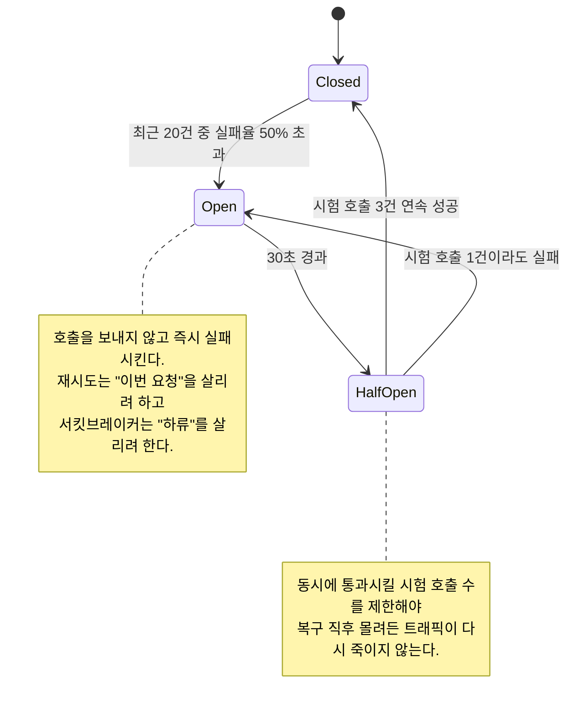

# Architecture Notes

https://architecturenotes.co/

## 한 줄
Mahdi Yusuf가 쓰는 시스템 설계 뉴스레터·아티클 모음. Redis, 샤딩, 로드밸런서, 서킷브레이커, 쿼럼, 락 경합 같은 주제를 한 편에 하나씩 큰 도해와 함께 풀어 놓은 곳이다.

## 페르소나
**개념 자체는 아는데, 그걸 팀 회의에서 화이트보드 없이 설명하다 매번 실패하는 엔지니어.** "샤딩을 하면 왜 크로스 샤드 조인이 문제가 되는지", "서킷브레이커가 왜 재시도와 다른 문제를 푸는지"를 비전공 동료나 주니어에게 설명해야 하는데, 원 논문이나 공식 문서는 그림이 없거나 너무 무겁다. 지금 필요한 건 슬라이드에 붙일 수 있는 한 장짜리 설명이다.

## 이럴 때 연다
- 설계 리뷰나 온보딩 자료에서 Redis·샤딩·로드밸런서·쿼럼 같은 개념을 그림으로 설명해야 할 때
- 특정 컴포넌트를 도입하기 전에 그것이 무엇을 해결하고 무엇을 못 하는지 30분 안에 감을 잡고 싶을 때
- 기술부채, 락 경합처럼 팀 안에서 말은 자주 나오지만 정의가 흐릿한 주제를 정리할 때

## 이럴 땐 아니다
- 실제 대규모 서비스의 사례와 아키텍처 발표 자료가 필요하면 `architecture/awesome-scalability.md`
- 면접·학습용으로 시스템 디자인 전 범위를 체계적으로 훑고 싶으면 `architecture/system-design-primer.md` 또는 `architecture/bytebytego.md`
- 데이터 시스템의 원리를 깊게 파야 하면 `architecture/designing-data-intensive-applications.md`
- 서킷브레이커·재시도의 구현 지침 수준이 필요하면 `architecture/azure-architecture-cloud-design-patterns.md`

## 무엇이 들어있나
한 편이 하나의 컴포넌트나 개념을 다루고, 그 안에서 "왜 이게 필요해졌는가 → 어떻게 동작하는가 → 어떤 대가를 치르는가" 순으로 전개된다. 도해의 밀도가 높아서, 글을 읽지 않고 그림만 떼어도 설명 자료가 되는 편이다.

교과서와 다른 점은 트레이드오프를 앞에 놓는다는 것이다. 예컨대 샤딩 글은 샤딩 방법보다 샤딩 이후에 잃는 것(트랜잭션, 조인, 리밸런싱 비용)에 지면을 쓴다. 다만 주간 뉴스레터 형식이라 주제 배열에 체계는 없다 — 커리큘럼이 아니라 사전처럼 필요한 항목만 찾아 읽는 자료다.

## 인용 포인트
- 개념 설명 도해를 팀 문서에 인용할 때 출처가 명확한 단일 저자 사이트라 링크하기 좋다(저자: Mahdi Yusuf).

## 코드 예시

"서킷브레이커가 왜 재시도와 다른 문제를 푸는지"를 화이트보드 없이 설명해야 할 때 문서에 그대로 붙이는 상태 기계 도해.

그림이 감추는 건 이 상태가 프로세스 하나의 것이라는 점이다 — 인스턴스 50대면 하류는 열리기 전까지 50배의 실패 트래픽을 받고, 호출량이 적은 엔드포인트에서는 표본이 모자라 브레이커가 늦게 열리거나 열닫힘을 반복한다. 임계값 세 개(20건·50%·30초)가 실은 이 도해의 본체다.
