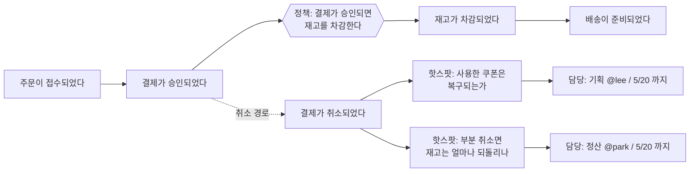

# Event Storming

https://www.eventstorming.com/

## 한 줄
Alberto Brandolini가 고안한 워크숍 기법의 공식 사이트 — 도메인 전문가와 개발자를 한 방에 넣고 **"일어난 일(도메인 이벤트)"을 과거형으로 벽에 붙여 시간순으로 늘어놓는 것만으로** 업무 흐름·누락된 요구사항·모듈 경계를 동시에 드러내는 방법이다.

## 페르소나
**기획서를 받아 구현했는데 배포 직전에야 "환불된 주문의 쿠폰은 어떻게 되나요?" 같은 질문이 튀어나오는 상황이 반복되는 개발자 또는 기획자.** 문제는 기획서의 품질이 아니라, 도메인 전체 흐름을 한 번도 같은 화면에 놓고 본 적이 없다는 것이다. 각자 자기 구간만 알고 있고, 구간 사이의 예외 경로에는 주인이 없다. 회의를 여러 번 해도 말로만 오가서 남는 게 없는 상태.

## 이럴 때 연다
- 새 도메인이나 큰 기능의 기획을 시작하며, 기획·개발·QA가 흐름 이해를 맞춰야 할 때
- 요구사항 누락(특히 취소·환불·실패 같은 예외 경로)을 설계 전에 잡아내고 싶을 때
- 모놀리스를 쪼개거나 모듈 경계를 정해야 하는데 어디를 잘라야 할지 근거가 없을 때
- 레거시 시스템의 실제 동작을 아무도 통째로 설명하지 못할 때, 아는 사람들을 모아 복원할 때
- 이벤트 기반 아키텍처를 도입하기 전에 도메인 이벤트 목록 자체를 확정할 때

## 이럴 땐 아니다
- 워크숍 중 용어(Command, Aggregate, Policy, Read Model, Hotspot 등)의 색깔·의미만 빠르게 확인하려면 `architecture/event-storming-2.md`
- 워크숍은 이미 했고 그 다음 단계(바운디드 컨텍스트 → 아키텍처 → 전술 설계)의 순서를 알고 싶으면 `architecture/ddd-starter-modelling-process.md`
- 사용자 여정 관점에서 릴리스 범위를 자르는 것이 목적이면 `planning/user-story-mapping.md`
- 목표와 이해관계자에서 역산해 무엇을 만들지 정하는 것이면 `planning/impact-mapping.md`
- 결과물을 아키텍처 다이어그램으로 옮기는 단계면 `architecture/c4-model.md`

## 무엇이 들어있나
사이트는 기법의 소개, 진행 형식의 종류, 자료와 워크숍 정보를 제공한다. 핵심 규칙은 놀랄 만큼 단순하다 — **큰 종이를 벽에 붙이고, 오렌지색 포스트잇에 도메인 이벤트를 과거형 동사로 적어("주문이 결제되었다", "쿠폰이 만료되었다") 시간순으로 늘어놓는다.** 그 다음 이벤트를 일으킨 커맨드, 관련 액터, 정책, 외부 시스템, 그리고 마지막에 애그리거트를 색깔별로 얹어간다.

여러 형식이 있다는 점이 잘 알려져 있지 않다. **Big Picture**는 조직 전체 흐름을 훑어 경계를 찾는 용도, **Process Modelling**은 특정 프로세스를 상세화하는 용도, **Software Design**은 곧바로 구현으로 이어지는 수준까지 내려가는 용도다. 처음 시도하는 팀이 Big Picture와 Software Design을 섞어버려 실패하는 경우가 흔하다.

통념과 어긋나는 지점 몇 가지. (1) **결과물인 다이어그램보다 그 자리에서 발생한 대화가 진짜 산출물**이다 — 사진 한 장만 남기고 벽을 치워도 된다는 입장이다. (2) 진행자는 정답을 알 필요가 없고, 오히려 **의견이 충돌하거나 아무도 답을 모르는 지점(hotspot)을 찾아 표시하는 것이 목적**이다. 매끄럽게 끝난 워크숍은 대개 실패한 워크숍이다. (3) **도메인 전문가가 반드시 방에 있어야 한다** — 개발자끼리 하는 이벤트 스토밍은 이미 알던 것을 벽에 옮겨 적는 일에 그친다. (4) 모델링 도구나 표기 규칙보다 **공간과 시간(큰 벽, 몇 시간의 집중)**이 성공 조건이라는 점을 반복해서 강조한다.

## 인용 포인트
- "산출물은 다이어그램이 아니라 대화" — 워크숍에 시간을 쓰는 것에 대한 회의적 반응에 답할 때의 프레임.
- hotspot(합의되지 않았거나 아무도 모르는 지점)을 명시적으로 표시한다는 규칙은, 회의에서 불편한 질문을 꺼내도 되는 안전장치로 쓰이며 그 자체로 요구사항 누락 방지 장치가 된다.
- 도메인 이벤트를 과거형으로 쓰라는 단순한 제약이, 상태 중심 사고(테이블 설계)에서 흐름 중심 사고로 논의를 옮기는 데 실제로 효과가 있다는 점은 워크숍 제안서에 인용할 만하다.

## 코드 예시

워크숍 벽을 문서로 옮긴 조각 — 과거형 이벤트를 시간순으로 늘어놓자 예외 경로에서 주인 없는 질문(핫스팟)이 드러나는 지점까지가 이 기법의 산출물이다.

값어치 있는 건 위쪽 주황 줄이 아니라 아래쪽 핫스팟 두 개다 — 담당자와 기한이 안 붙으면 그 질문은 배포 직전에 그대로 돌아온다. 그리고 이 그림은 도메인 전문가가 그 방에 있었는지를 보여주지 않는다. 개발자끼리 그린 보드는 도메인이 아니라 현행 코드의 그림이고, 그때는 예외 경로 자체가 벽에 안 붙는다.
