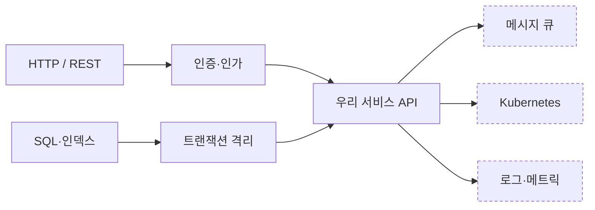

# Developer Roadmap

https://github.com/kamranahmedse/developer-roadmap

## 한 줄
프론트엔드·백엔드·데브옵스·QA 등 직군별로 "무엇을 어떤 순서로 배우는가"를 노드 그래프로 그린 인터랙티브 로드맵 — 각 노드에 필수/권장 표시가 붙어 있는 게 핵심이다.

## 페르소나
**신입 채용 JD 를 써야 하는데 "백엔드 개발자"에 무엇까지 요구할지 스스로도 정리가 안 된 팀리드, 또는 팀원의 성장 계획을 짜야 하는 사수.** 기술 목록을 나열하면 끝없이 길어지고, 줄이자니 무엇이 필수이고 무엇이 있으면 좋은 건지 판단 기준이 없다. 남이 이미 그려 놓은 지도 위에서 선을 긋고 싶다.

## 이럴 때 연다
- 채용 공고의 기술 범위를 정하고 "필수 / 우대"를 나눌 때
- 팀원의 개인 성장 계획이나 온보딩 학습 순서를 설계할 때
- 익숙하지 않은 직군(예: 데브옵스, 데이터)의 전체 지형을 빠르게 파악해야 할 때
- 본인이 다음에 뭘 배울지 정하면서 빠진 기초가 있는지 점검할 때

## 이럴 땐 아니다
- 목록을 아는 게 아니라 직접 만들어 이해하는 단계라면 `development/build-your-own-x.md`
- CS 개념 자체의 요약 정리는 `development/every-programmer-should-know.md`
- 코드 품질·리뷰·설계 같은 실무 관행의 읽을거리는 `development/professional-programming.md`
- 조직·리더십 역할로 넘어가는 경로는 `development/awesome-cto.md` 와 `development/engineering-manager.md`
- 어떤 기술을 실제로 채택할지의 판단은 학습 지도가 아니라 `development/thoughtworks-technology-radar.md`

## 무엇이 들어있나
로드맵이 웹에서 인터랙티브하게 열리고, 각 노드를 클릭하면 짧은 설명과 학습 자료 링크가 나온다. 목록형 큐레이션과 다른 지점은 **의존 관계와 순서**가 그려져 있다는 것이다.
노드마다 색으로 "반드시 / 권장 / 대안" 이 구분돼 있어, 전부 배워야 한다는 압박을 줄인다.
직군 로드맵 외에 개별 기술(React, Node.js, Python, Docker, Kubernetes, SQL 등) 단위 로드맵과, 시스템 디자인·코드 리뷰 같은 주제 로드맵이 따로 있다.
한계도 분명하다 — 로드맵은 기술 이름의 지도이지 역량의 지도가 아니다. 노드를 다 채운 사람이 좋은 엔지니어라는 보장은 없고, 저자 본인도 "전부 배우라는 뜻이 아니다"라고 못 박는다. JD 에 쓸 때 이 목록을 그대로 옮겨 붙이면 지원자를 걸러내는 게 아니라 쫓아내게 된다.

## 인용 포인트
- 채용 요구사항이 비대해질 때, "이 로드맵에서도 권장 표시인 항목"이라는 근거로 필수에서 빼는 협상을 할 수 있다.

## 코드 예시

이 자료의 형식이 목록이 아니라 **의존 관계 + 필수/권장 구분**이라는 점을 그대로 가져와, 우리 팀 버전으로 잘라낸 것. JD 나 온보딩 계획에 붙는 산출물은 결국 이 모양이다.

점선 노드가 협상 대상이라는 것 외에, 이 그림이 말해 주지 않는 게 하나 있다 — 노드는 기술 이름이지 역량이 아니다. 다 채운 사람이 좋은 엔지니어라는 보장은 없고, 원본을 그대로 JD 로 옮기면 지원자를 거르는 게 아니라 쫓아내게 된다.
